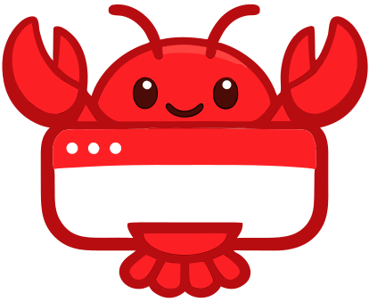

<p align="center">
  
</p>

<h1 align="center">Pulse Browser</h1>

<p align="center">
  <strong>The World's First Native Live-Agent Browser</strong><br/>
  Powered by Gemini Live API + Autonomous DOM Intelligence
</p>

<p align="center">
  <a href="#architecture">Architecture</a> &bull;
  <a href="#features">Features</a> &bull;
  <a href="#quick-start">Quick Start</a> &bull;
  <a href="#deployment">Deployment</a> &bull;
  <a href="#how-it-works">How It Works</a> &bull;
  <a href="#tech-stack">Tech Stack</a>
</p>

---

## What is Pulse?

Pulse is an **AI-native web browser** with a built-in voice agent called **Lobster**. You talk to it, it talks back — and it can autonomously control the browser to complete tasks for you. Think Jarvis, but for the web.

Unlike browser extensions or copilots that overlay on top of Chrome, Pulse is built from scratch as an Electron app where the AI agent is a **first-class citizen** — it has its own tabs, its own vision, and can act independently of what you're looking at.

**Built for the [Gemini API Developer Competition](https://ai.google.dev/competition) — Gemini Live Agent Challenge.**

**Category:** UI Navigator

---

## Architecture

Pulse uses a **Two-Brain Architecture** — a Conductor and Executor working in tandem:

```
┌─────────────────────────────────────────────────────────┐
│                    ELECTRON APP                          │
│                                                          │
│  ┌──────────┐  ┌──────────┐  ┌──────────┐              │
│  │ User Tab │  │ Agent Tab│  │ Agent Tab│  ...          │
│  │ (active) │  │ (task 1) │  │ (task 2) │              │
│  └──────────┘  └──────────┘  └──────────┘              │
│       │              │              │                    │
│  ┌────┴──────────────┴──────────────┴───────────┐      │
│  │              React Chrome Bar                 │      │
│  │   [Tabs] [URL] [Voice Orb] [Chat] [Tasks]   │      │
│  └──────────────────┬───────────────────────────┘      │
│                     │ WebSocket                         │
└─────────────────────┼───────────────────────────────────┘
                      │
┌─────────────────────┼───────────────────────────────────┐
│               FASTAPI BACKEND                            │
│                     │                                    │
│  ┌──────────────────┴──────────────────────┐            │
│  │           CONDUCTOR (Brain 1)            │            │
│  │     Gemini Live API (Bidirectional)      │            │
│  │     gemini-2.5-flash-native-audio        │            │
│  │                                          │            │
│  │  • Hears user voice in real-time         │            │
│  │  • Speaks back with personality          │            │
│  │  • Decides what tasks to execute         │            │
│  │  • Delegates to Executor via tool call   │            │
│  └─────────────────┬────────────────────────┘            │
│                    │ execute_user_intent()                │
│  ┌─────────────────┴────────────────────────┐            │
│  │           EXECUTOR (Brain 2)              │            │
│  │     Gemini Standard API (Vision)          │            │
│  │     gemini-2.5-flash                      │            │
│  │                                           │            │
│  │  • Receives screenshot + element map      │            │
│  │  • Plans multi-step actions               │            │
│  │  • Controls browser via tool calls        │            │
│  │  • Verifies task completion visually      │            │
│  │  • Reports results back to Conductor      │            │
│  └───────────────────────────────────────────┘            │
└──────────────────────────────────────────────────────────┘
```

### Why Two Brains?

| | Conductor | Executor |
|---|---|---|
| **Model** | `gemini-2.5-flash-native-audio` | `gemini-2.5-flash` |
| **Mode** | Bidirectional streaming (Live API) | Request-response with vision |
| **Role** | Voice conversation + task routing | Browser automation + verification |
| **Latency** | Real-time (~200ms) | Per-step (~1-3s) |
| **Input** | User's voice audio stream | Screenshots + DOM element map |
| **Output** | Speech audio + tool calls | Browser actions + status updates |

The Conductor maintains a **live voice conversation** with the user while the Executor works **autonomously in background tabs**. You can keep browsing while the agent works.

---

## Features

### Voice-First Interaction
- **Always-on microphone** — speak naturally, no push-to-talk
- **Real-time conversation** — sub-second voice responses
- **Barge-in support** — interrupt the agent mid-sentence
- **Wake word** — say "Hey Lobster" to activate from idle
- **Multilingual input** — speak any language, agent responds in English

### Autonomous Browser Control
- **Vision-based navigation** — agent sees screenshots, not just DOM
- **Element map system** — numbered DOM element references for precise clicking
- **Background tab execution** — agent works in its own tabs independently
- **Multi-task parallel execution** — multiple tasks in separate tabs simultaneously
- **Self-healing DOM** — auto-dismisses popups, cookie banners, modals
- **Loop detection** — breaks out of repetitive action patterns
- **Visual verification** — agent takes a final screenshot to confirm task completion

### Smart UI
- **Aurora start page** — animated glassmorphism homepage with capability grid
- **Live task panel** — real-time step-by-step progress for each task
- **Agent thoughts** — see the agent's reasoning in real-time (ReAct pattern)
- **Comet overlay** — ambient visual effects showing agent activity
- **Command palette** — type commands directly when voice isn't convenient
- **Find bar** — in-page search (Ctrl+F)

### Tab Swarm
- **Parallel multi-site tasks** — "Compare prices on Amazon, eBay, and Walmart"
- **Automatic decomposition** — complex goals broken into parallel subtasks
- **Result aggregation** — combined summary spoken back to user

### Recurring Tasks (Cron)
- **Scheduled monitoring** — "Check Reddit for new posts every 5 minutes"
- **Configurable intervals** — adjust timing from the task panel
- **Proactive notifications** — agent speaks updates as they arrive

### Design
- **Awwwards-level aesthetic** — glassmorphism, aurora gradients, micro-animations
- **Lobster red branding** — `#B70D11` / `#FF2B44`
- **Inter + Italiana fonts** — clean UI typography + elegant branding
- **Framer Motion animations** — smooth transitions throughout

---

## Quick Start

### Prerequisites

- **Node.js** 18+ and npm
- **Python** 3.12+
- **Google AI API key** — get one at [aistudio.google.com](https://aistudio.google.com/apikey)

### 1. Clone the repo

```bash
git clone https://github.com/ma1orek/Pulse.git
cd Pulse
```

### 2. Backend setup

```bash
cd backend
pip install -r requirements.txt
```

Create `backend/.env`:

```env
GOOGLE_API_KEY=your-gemini-api-key-here
```

Start the backend:

```bash
uvicorn main:app --host 0.0.0.0 --port 8080
```

### 3. Electron app setup

```bash
cd electron
npm install
npm start
```

The browser window opens. Allow microphone access and start talking!

### Windows Quick Start

Double-click `start.bat` in the project root — it launches both backend and Electron app.

---

## Deployment

### Google Cloud Run (Production)

Pulse includes full infrastructure-as-code for deploying the backend to Google Cloud Run.

#### One-click deploy

```bash
cd deploy
chmod +x deploy.sh
./deploy.sh
```

This script:
1. Enables required GCP APIs (Cloud Run, Firestore, Storage, AI Platform)
2. Creates Firestore database for session persistence
3. Creates Cloud Storage bucket for screenshot archival
4. Builds and deploys the backend container to Cloud Run
5. Outputs the WebSocket URL to configure in the Electron app

#### Terraform (alternative)

```bash
cd terraform
cp terraform.tfvars.example terraform.tfvars
# Edit terraform.tfvars with your GCP project ID and API key
terraform init
terraform apply
```

#### Cloud Run configuration

| Setting | Value |
|---|---|
| Memory | 1 Gi |
| CPU | 1 |
| Min instances | 1 |
| Max instances | 3 |
| Timeout | 3600s (1 hour) |
| Session affinity | Enabled |

---

## How It Works

### The Agent Loop

When you say "Send a message to John on LinkedIn":

1. **Conductor** hears your voice via Gemini Live API bidirectional streaming
2. **Conductor** calls `execute_user_intent("Send a message to John on LinkedIn")`
3. **Backend** creates a dedicated agent tab, navigates to LinkedIn
4. **Backend** takes a screenshot + gathers DOM element map from the tab
5. **Executor** receives screenshot (vision) + element map (text), plans steps
6. **Executor** calls tools: `click_by_ref(ref=5)`, `type_into_ref(ref=12, text="Hey John!")`, etc.
7. After each action, a **new screenshot + fresh element map** is captured
8. **Executor** verifies completion visually, calls `done(summary="Message sent")`
9. **Conductor** speaks the result: "Done! Message sent to John on LinkedIn!"

### Element Map System

Instead of fragile CSS selectors or XPath, Pulse uses a **numbered element reference system**:

```
PAGE ELEMENTS:
#0  BTN "Send Message"
#1  INPUT "Search..." (placeholder)
#2  LINK "John Smith" href="/in/johnsmith"
#3  A "Home"
#4  TEXTAREA "Write a message..." (contenteditable)
```

Each interactive DOM element gets a `data-lobster-id` attribute. The agent uses `click_by_ref(ref=0)` to click "Send Message" — **100% accurate**, no coordinate guessing.

### Executor Tools

| Tool | Description |
|---|---|
| `click_by_ref(ref)` | Click element by map ID (primary) |
| `type_into_ref(ref, text)` | Type into input by map ID (primary) |
| `navigate(url)` | Open a URL |
| `execute_js(code)` | Run JavaScript on page |
| `wait_for(condition, target)` | Smart wait (page_load, network_idle, element_visible, text_visible) |
| `click(x, y)` | Click by coordinates (fallback for canvas) |
| `type_text(text)` | Type at cursor position |
| `press_key(key)` | Press keyboard key |
| `scroll(direction)` | Scroll page |
| `drag(from, to)` | Drag between coordinates |
| `draw_path(points)` | Draw on canvas |
| `done(summary)` | Signal task completion |

### Screenshot Capture

Pulse captures screenshots from agent tabs even when they're **not visible** to the user:

- **Active tabs**: Standard Electron `capturePage()` API
- **Background tabs**: Chrome DevTools Protocol `Page.captureScreenshot` via Electron's debugger API
- **No flickering**: CDP capture works without bringing tabs to front
- All tabs have `backgroundThrottling: false` to prevent Chromium from pausing rendering

### ReAct Reasoning

The Executor follows the **OBSERVE → THINK → ACT** pattern:

1. **OBSERVE**: Look at the screenshot, read the element map
2. **THINK**: Plan what to do next (streamed to UI as "agent thoughts")
3. **ACT**: Call a tool (click, type, navigate, etc.)
4. **VERIFY**: Check the new screenshot — did it work?

Thoughts are displayed in the chat panel in real-time, filtered to show only meaningful reasoning (no raw element data or code fragments).

---

## Tech Stack

### Frontend (Electron)

| Technology | Version | Purpose |
|---|---|---|
| Electron | 40.6.0 | Desktop browser shell with WebContentsView |
| React | 19.2.4 | UI components |
| TypeScript | ~5.4 | Type safety |
| Framer Motion | 12.34.3 | Animations and transitions |
| Tailwind CSS | 4.2.1 | Utility-first styling |
| Webpack | 5 | Module bundling (via electron-forge) |

### Backend (Python)

| Technology | Version | Purpose |
|---|---|---|
| FastAPI | 0.115+ | Web framework + WebSocket server |
| Google ADK | 1.2+ | Agent Development Kit for Gemini |
| Google GenAI | 1.14+ | Gemini API client |
| Pillow | 11+ | Screenshot image processing |
| NumPy | 2.0+ | Audio signal processing |
| ai-coustics SDK | 2.0+ | Optional speech enhancement |

### Infrastructure

| Technology | Purpose |
|---|---|
| Google Cloud Run | Backend hosting (serverless containers) |
| Firestore | Session persistence and conversation history |
| Cloud Storage | Screenshot archival |
| Terraform | Infrastructure-as-code |
| Cloud Build | Container image builds |

### AI Models

| Model | Role |
|---|---|
| `gemini-2.5-flash-native-audio-latest` | Conductor — voice conversation (Live API) |
| `gemini-2.5-flash` | Executor — browser automation with vision |

---

## Google Cloud Services Used

- **Cloud Run** — Backend hosting with WebSocket support and session affinity
- **Firestore** — Session history and page memory (stateful browsing)
- **Cloud Storage** — Screenshot archive for conversation context
- **Vertex AI** — Gemini model access (production)
- **Artifact Registry** — Container image storage
- **Cloud Build** — CI/CD pipeline

---

## Project Structure

```
Pulse/
├── backend/
│   ├── main.py              # FastAPI server, Conductor + Executor logic
│   ├── skills/              # Modular browser automation skills
│   │   ├── _base.py         # Shared infrastructure
│   │   ├── navigation.py    # URL navigation
│   │   ├── clicking.py      # Element clicking
│   │   ├── input.py         # Text input
│   │   ├── scrolling.py     # Page scrolling
│   │   ├── tabs.py          # Tab management
│   │   ├── interaction.py   # DOM interactions
│   │   ├── extraction.py    # Data extraction
│   │   ├── vision.py        # Screenshot analysis
│   │   ├── clipboard.py     # Clipboard ops
│   │   ├── creative.py      # Creative interactions
│   │   └── advanced_browser.py
│   ├── requirements.txt
│   ├── Dockerfile
│   └── .env                 # GOOGLE_API_KEY (create this)
├── electron/
│   ├── src/
│   │   ├── index.ts         # Main process: tabs, screenshots, IPC
│   │   ├── App.tsx          # React UI: chrome bar, voice, chat
│   │   ├── preload.ts       # Context bridge for renderer
│   │   ├── index.css        # Global styles
│   │   ├── index.html       # Entry HTML
│   │   └── components/
│   │       ├── Aurora.tsx         # Animated background
│   │       ├── VoiceOrb.tsx       # Voice input pill
│   │       ├── TabBar.tsx         # Tab management
│   │       ├── AgentPanel.tsx     # Agent log display
│   │       ├── TaskPanel.tsx      # Task + chat panel
│   │       ├── CommandPalette.tsx  # Command input
│   │       ├── CometOverlay.tsx   # Activity effects
│   │       ├── MessageOverlay.tsx # Notifications
│   │       ├── LobsterLogo.tsx    # SVG logo
│   │       ├── CapabilitiesGrid.tsx
│   │       ├── ConfirmModal.tsx
│   │       └── FindBar.tsx
│   ├── assets/              # App icons
│   ├── package.json
│   ├── forge.config.ts
│   └── webpack.main.config.ts
├── terraform/               # GCP infrastructure
│   ├── main.tf
│   ├── variables.tf
│   └── outputs.tf
├── deploy/
│   ├── deploy.sh            # One-click Cloud Run deploy
│   └── cloudbuild.yaml
├── public/                  # Static assets
├── start.bat                # Windows quick-start
└── LICENSE                  # Apache 2.0
```

---

## Environment Variables

| Variable | Required | Description |
|---|---|---|
| `GOOGLE_API_KEY` | Yes | Gemini API key from AI Studio |
| `GCP_PROJECT_ID` | For deploy | Google Cloud project ID |
| `FIRESTORE_DB` | Optional | Firestore database name (default: lobster-memory) |
| `GCS_BUCKET` | Optional | Cloud Storage bucket for screenshots |
| `AICOUSTICS_LICENSE_KEY` | Optional | ai-coustics speech enhancement license |

---

## License

[Apache License 2.0](LICENSE) — Copyright 2026 Bartosz Idzik ([@ma1orek](https://github.com/ma1orek))

---

<p align="center">
  <sub>Built with Gemini Live API for the <a href="https://ai.google.dev/competition">Google AI Developer Competition</a></sub>
</p>
